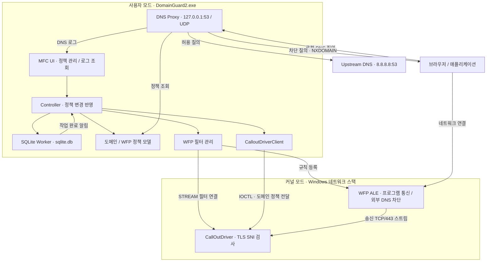

[README.md](https://github.com/user-attachments/files/32098896/README.md)
# DomainGuard

**DNS 프록시와 Windows Filtering Platform을 결합한 Windows 네트워크 접근 제어 프로젝트**

DomainGuard는 도메인과 실행 파일을 기준으로 네트워크 접근을 제어하는 C++ 프로젝트입니다. MFC 화면에서 차단 정책을 관리하고, 로컬 DNS 프록시와 WFP 필터, 커널 모드 Callout Driver를 통해 DNS 질의부터 HTTPS 연결까지 검사합니다.

`C++` · `MFC` · `WinSock2 / IOCP` · `WFP` · `WDM Driver` · `SQLite`

## 주요 기능

| 기능 | 구현 내용 |
| --- | --- |
| DNS 도메인 차단 | 로컬 DNS 프록시가 질의 도메인을 검사하고, 차단 대상에는 `NXDOMAIN` 응답 반환 |
| 실시간 DNS 로그 | 요청 시각, 응답 시간, 도메인, 질의 유형, 허용·차단 결과 표시. 화면은 3초 주기로 갱신 |
| 하위 도메인 정책 | 상위 도메인에 등록한 차단 정책을 하위 도메인에도 적용 |
| 실행 파일별 통신 차단 | 프로그램 경로, 통신 방향, 프로토콜, IP, 포트를 조합한 WFP 규칙 관리 |
| 외부 DNS 직접 질의 제한 | DomainGuard 이외 프로그램의 외부 TCP/UDP 53번 포트 연결 차단 |
| HTTPS SNI 검사 | 커널 드라이버에서 TLS ClientHello의 서버 이름을 추출하고 차단 정책과 비교 |
| 정책 저장 | SQLite에 도메인·프로그램 차단 정책을 저장하고 다음 실행 시 다시 적용 |

### 도메인 정책

상위 도메인을 등록하면 해당 도메인과 하위 도메인을 함께 차단합니다. 예를 들어 `example.com`을 차단 목록에 추가했을 때의 적용 범위는 다음과 같습니다.

| 질의 도메인 | 정책 적용 |
| --- | --- |
| `example.com` | 차단 |
| `www.example.com` | 차단 |
| `api.dev.example.com` | 차단 |
| `other-example.com` | 해당 규칙의 차단 대상 아님 |

현재 입력 형식은 `example.com`과 같은 도메인 이름입니다. `*.example.com` 형태의 와일드카드 문법은 지원하지 않습니다. 체크박스를 해제하면 해당 규칙이 비활성화되며, 상위 도메인에 활성화된 차단 규칙이 있으면 그 규칙은 계속 적용됩니다.

### 프로그램별 통신 정책

실행 파일을 선택한 뒤 다음 조건을 조합해 차단 규칙을 등록합니다.

| 조건 | 선택 범위 |
| --- | --- |
| 대상 | `.exe` 파일 경로 |
| 통신 방향 | 수신 / 송신 / 양방향 |
| 프로토콜 | TCP / UDP / 전체 |
| IP | 전체 / 단일 IPv4 주소 |
| 포트 | 전체 / 단일 포트 |

실행 파일 경로에서 WFP Application ID를 생성해 정책을 적용합니다. 동일한 실행 파일에서 만들어진 프로세스에 적용되는 방식이며, PID 단위 규칙은 제공하지 않습니다.

## 시스템 구조



DNS 질의는 로컬 프록시에서 처리하고, 프로그램별 통신 제어는 WFP의 ALE 계층에서 수행합니다. HTTPS 연결은 WFP 스트림 계층의 Callout Driver로 전달해 SNI를 검사합니다. UI와 각 처리 모듈의 생성·연결은 `AppContext`가 담당합니다.

## 핵심 구현

### 1. 비동기 DNS 응답 처리

로컬 UDP 소켓으로 DNS 요청을 받고, 허용된 요청은 업스트림 DNS 서버로 전달합니다. 외부 응답 수신에는 Overlapped I/O와 IOCP를 사용합니다.

요청마다 프록시 ID를 부여하고 원본 DNS ID와 클라이언트 주소를 함께 보관합니다. 응답이 도착하면 프록시 ID로 요청을 찾고 원본 ID를 복원해 해당 클라이언트에 전달합니다.

관련 코드: [DNS 초기화](DomainGuard2/Service/DNS/DNS.cpp), [질의 처리](DomainGuard2/Service/DNS/WK_DNS.cpp), [IOCP 응답 처리](DomainGuard2/Service/DNS/WK_DNS_GQCS.cpp), [요청 ID 관리](DomainGuard2/Service/DNS/ProxyID_Store.cpp)

### 2. WFP 기반 접근 제어

`FwpmGetAppIdFromFileName0`으로 실행 파일의 Application ID를 구하고, 연결 방향에 따라 `ALE_AUTH_CONNECT` 또는 `ALE_AUTH_RECV_ACCEPT` 계층에 차단 필터를 등록합니다. 전체 IP 규칙은 IPv4·IPv6 계층에 적용합니다.

외부 DNS 직접 질의 제한에는 별도의 초기 규칙을 사용합니다. DomainGuard 자체와 루프백 연결을 제외하고 다른 프로그램의 외부 TCP/UDP 53번 포트 연결을 차단해, 로컬 DNS 프록시를 거치는 질의를 유도합니다.

관련 코드: [WFP 정책과 SNI 필터 등록](DomainGuard2/Service/WFP/WFP.cpp)

### 3. 커널 모드 HTTPS SNI 검사

`FWPM_LAYER_STREAM_V4`와 `FWPM_LAYER_STREAM_V6`에서 송신 방향의 원격 TCP 443번 포트 트래픽을 검사합니다. TLS ClientHello의 `server_name` 확장에서 호스트 이름을 추출하고, 차단 대상이면 `FWPS_STREAM_ACTION_DROP_CONNECTION`으로 연결을 종료합니다.

TLS 레코드를 읽는 데 필요한 스트림 데이터가 부족하면 `SNI_NEED_MORE`를 반환하고 WFP에 추가 데이터를 요청합니다. 검사 범위는 ClientHello에 노출된 서버 이름이며 HTTPS 본문을 복호화하지 않습니다.

관련 코드: [Callout Driver](CallOutDriver/Driver.cpp), [TLS/SNI 파서](CallOutDriver/SniPaser.cpp)

### 4. 정책 저장과 사용자·커널 모드 연동

도메인 정책은 `domain_guard`, 프로그램 정책은 `wfp` 테이블에 저장합니다. SQLite 작업은 전용 워커와 작업 큐에서 처리하고, 완료 메시지를 받은 Controller가 모델과 화면을 갱신합니다. 도메인 정책 변경은 `DeviceIoControl`을 통해 드라이버에도 전달합니다.

공유 헤더에 IOCTL 코드와 요청 구조체를 정의해 사용자 모드 프로그램과 커널 드라이버가 같은 인터페이스를 사용합니다.

관련 코드: [SQLite 워커](DomainGuard2/Service/WK_SQLITE.cpp), [Controller](DomainGuard2/Controller/Controller.cpp), [드라이버 클라이언트](DomainGuard2/Service/CalloutDriverClient/CalloutDriverClient.cpp), [공유 IOCTL](SharedIoctl/SharedIoctl.h)

## 빌드 및 실행

### 개발 환경

프로젝트 설정은 Visual Studio 2022와 x64 구성을 기준으로 합니다.

| 구성 요소 | 요구 사항 |
| --- | --- |
| 운영체제 | Windows x64. 드라이버 프로젝트의 대상 설정은 Windows 10 |
| C++ 도구 | Visual Studio 2022, MSVC `v143`, C++ 데스크톱 개발 워크로드 |
| UI 라이브러리 | v143용 MFC 구성 요소 |
| 드라이버 도구 | `WindowsKernelModeDriver10.0` 도구 집합을 제공하는 WDK와 호환 Windows SDK |
| 데이터베이스 | 저장소에 포함된 SQLite 소스를 함께 빌드 |
| 실행 권한 | WFP 필터 등록, DNS 설정 변경, 드라이버 로드를 위한 관리자 권한 |

Visual Studio 버전에 맞는 WDK를 선택하고 SDK·WDK의 빌드 번호를 맞춰 설치합니다. 자세한 구성은 [Microsoft WDK 설치 안내](https://learn.microsoft.com/en-us/windows-hardware/drivers/download-the-wdk)를 참고하세요.

### 빌드

```powershell
git clone https://github.com/siroimono-0/DomainGuard.git
cd DomainGuard
```

1. `DomainGuard2.sln`을 Visual Studio에서 엽니다.
2. 솔루션 구성을 `Debug | x64` 또는 `Release | x64`로 선택합니다.
3. `DomainGuard2`와 `CallOutDriver` 프로젝트의 SDK·도구 집합 설정을 확인합니다.
4. 아래의 현재 코드 보완 사항을 반영한 뒤 솔루션을 빌드합니다.


### 기능 확인 예시

아래 항목은 수동 검증 절차이며 테스트 통과 기록은 아닙니다.

| 확인 항목 | 절차와 확인 내용 |
| --- | --- |
| DNS 차단 | `example.com`을 차단 목록에 추가한 뒤 `nslookup example.com 127.0.0.1`을 실행하고 NXDOMAIN 응답과 `Blocked` 로그 확인 |
| 하위 도메인 | 같은 정책에서 `nslookup www.example.com 127.0.0.1`도 차단되는지 확인 |
| 차단 해제 | 규칙을 비활성화한 뒤 다시 질의해 정상 DNS 응답과 `Allowed` 로그 확인 |
| 외부 DNS 제한 | `nslookup example.com 1.1.1.1`로 외부 서버에 직접 질의했을 때 요청이 제한되는지 확인 |
| 프로그램 통신 차단 | 테스트용 실행 파일을 등록하고 선택한 방향·프로토콜의 새 연결이 차단되는지 확인 |
| SNI 차단 | 드라이버를 로드하고, 테스트 도메인의 실제 IP를 지정한 TLS 클라이언트로 DNS 조회 없이 TCP/443 연결을 시도해 해당 SNI의 차단 여부 확인 |
| 정책 저장 | 정책 변경 후 GUI를 정상 종료·재실행해 도메인·프로그램 규칙이 다시 반영되는지 확인 |

SNI만 검사하려면 테스트 클라이언트의 프로그램 차단 규칙을 해제하고, TCP 기반 TLS와 평문 SNI를 사용해야 합니다. `curl.exe --http1.1 --resolve` 등을 사용하면 DNS 차단과 구분해서 확인할 수 있습니다.


## 디렉터리 구조

```text
DomainGuard/
├── DomainGuard2.sln
├── DomainGuard2/                 # MFC 사용자 모드 애플리케이션
│   ├── AppContext.*              # 컴포넌트 생성·연결과 종료 관리
│   ├── Controller/               # UI 요청과 정책 변경 처리
│   ├── Model/                    # 도메인·WFP 정책 및 로그 모델
│   ├── Service/
│   │   ├── DNS/                  # DNS 프록시와 IOCP 응답 처리
│   │   ├── WFP/                  # WFP 규칙과 SNI 필터 등록
│   │   ├── CalloutDriverClient/   # 사용자 모드 ↔ 커널 IOCTL 통신
│   │   └── *SQLITE*              # 정책 저장 워커와 결과 큐
│   └── SQLITE/                   # 포함된 SQLite 소스
├── CallOutDriver/                # WDM 기반 WFP Callout Driver
│   ├── Driver.cpp                # 장치·콜아웃·도메인 정책·IOCTL 처리
│   └── SniPaser.cpp              # TLS ClientHello와 SNI 파싱
├── SharedIoctl/                  # 공통 IOCTL 코드와 데이터 구조
└── 패킷_테스트/                  # 패킷 캡처 파일(.pcap)
```
